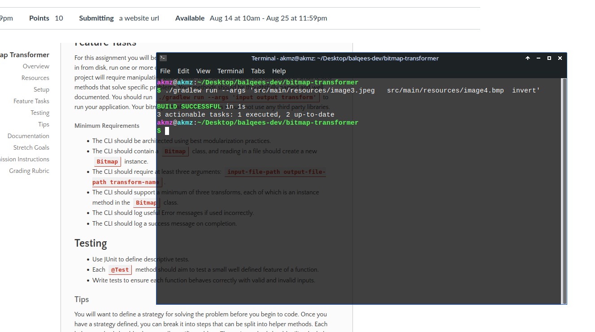
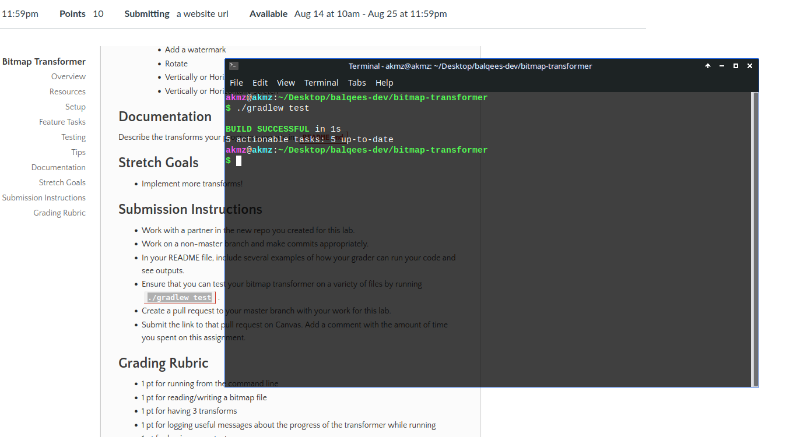
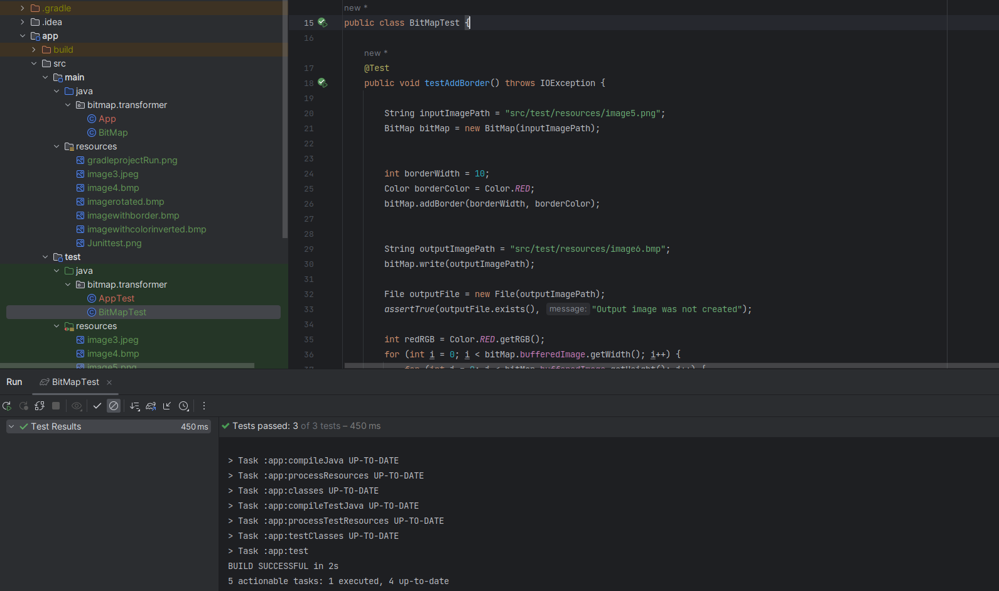

# Bitmap Transformer

The Bitmap Transformer is a Java application that allows you to apply various transforms to bitmap images. These 
transforms can modify the appearance of the images in different ways. The application supports the following transforms:

## Supported Transforms

### 1. Add Border

This transform adds a colored border to the image. Users can specify the width of the border and the color of the 
border.

### 2. Invert Colors
This transform inverts the colors of the image. Each color channel (red, green, and blue) is subtracted from 255 to 
create the inverted effect.

### 3. Rotate Image
This transform rotates the image by a specified angle (in degrees) around its center point.

---

### Getting Started
1. Clone this repository to your local machine.
2. Navigate to the project directory in the command line.
3. Run the Java application using Gradle with appropriate command-line arguments as shown in the usage examples above.

- Use this command line to run the application

  `./gradlew run --args 'inputImagePath outputImagePath invert'`

- Use this command to test Junit tests
  `./gradlew test`

